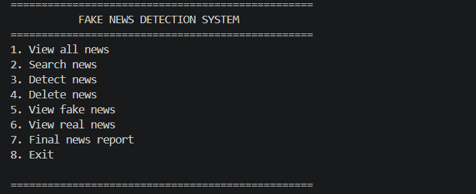
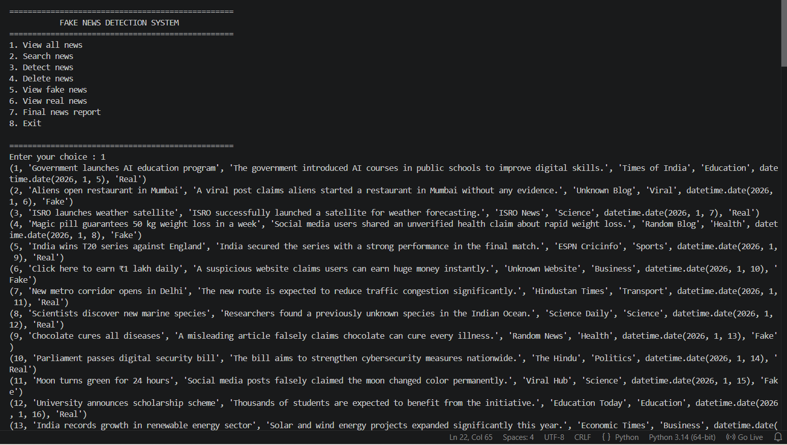
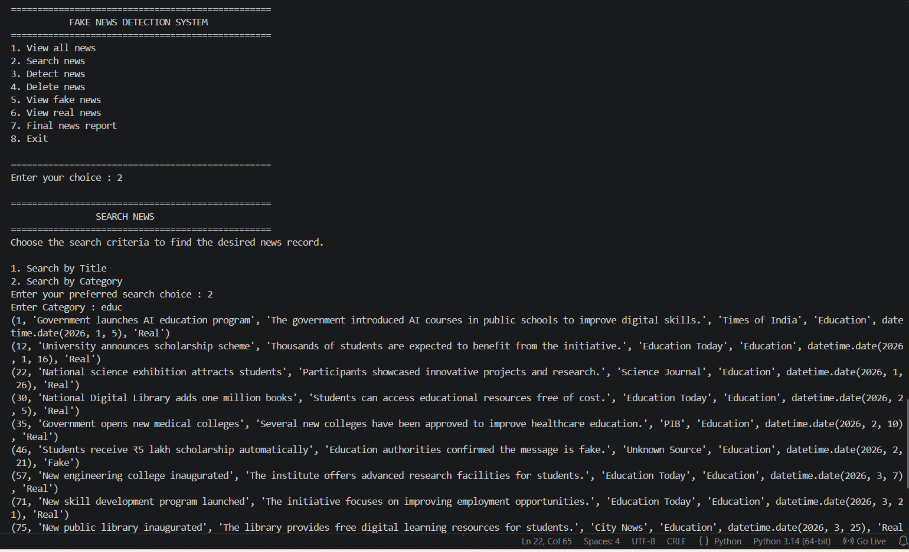
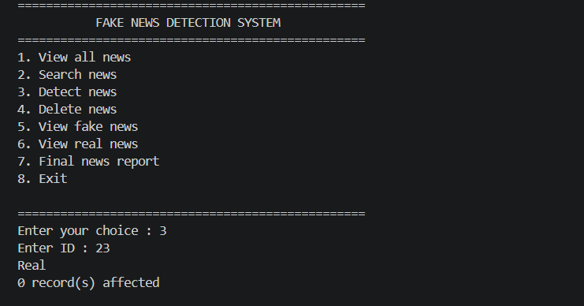
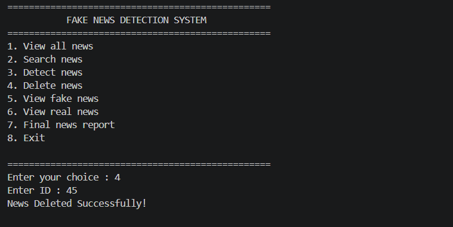
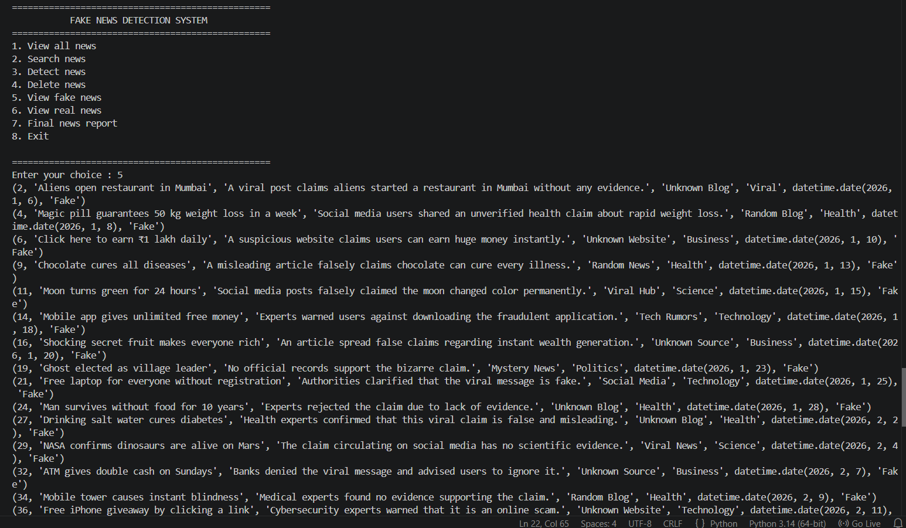
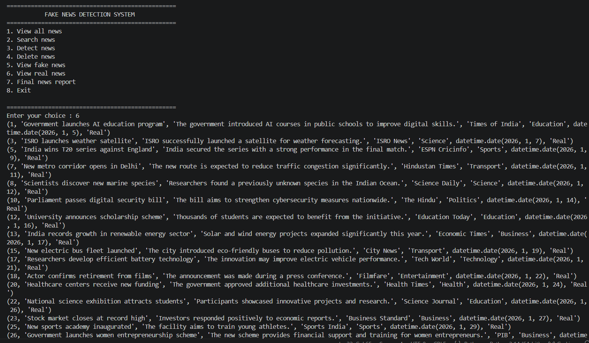
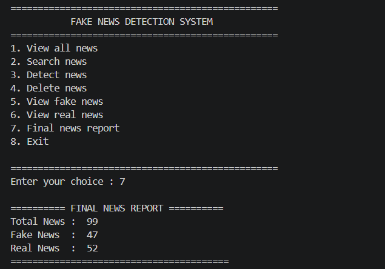
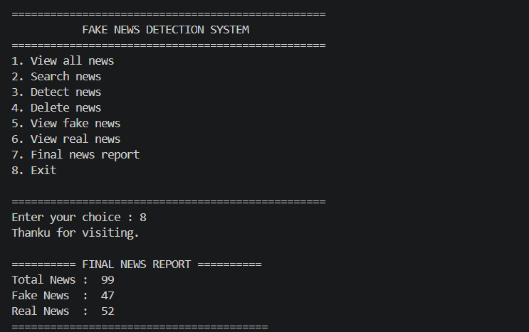

#  Fake News Detection System


A **Python + MySQL** based command-line application that detects whether a news article is **Real**, **Fake**, or **Needs Verification** using a simple keyword-based detection algorithm.

This project provides an easy way to manage news records, search articles, classify news, and generate statistics using a MySQL database.

---

#  Features

*  View all news records
*  Search news by **Title**
*  Search news by **Category**
*  Detect Fake or Real News
*  View all Fake News
*  View all Real News
*  Delete news records
*  Generate Final News Report
*  MySQL Database Integration
*  User-friendly Command Line Interface (CLI)

---

#  Technologies Used

* Python
* MySQL
* mysql-connector-python
* SQL
* Command Line Interface (CLI)

---

#  Project Screenshots

##  Main Menu



---

##  View All News



---

##  Search News



---

##  Fake News Detection



---

##  Delete News



---

##  View Fake News



---

##  View Real News



---

##  Final News Report



---

##  Exit



---

#  Database

**Database Name**

```text
khushi_db
```

**Table Name**

```text
news
```

### Table Structure

| Column      | Description      |
| ----------- | ---------------- |
| id          | News ID          |
| title       | News Title       |
| description | News Description |
| category    | News Category    |
| status      | Fake / Real      |

---

#  Installation

## Clone the Repository

```bash
git clone https://github.com/lakshmi1810-create/Fake-News-Detection-System.git
```

## Move to the Project Folder

```bash
cd Fake-News-Detection-System
```

## Install Required Library

```bash
pip install mysql-connector-python
```

## Create Database

```sql
CREATE DATABASE khushi_db;
```

Create the **news** table and insert your records.

Update the database credentials in the Python file:

```python
mydb = mysql.connector.connect(
    host="localhost",
    port=3306,
    user="root",
    password="",
    database="khushi_db"
)
```

Run the project:

```bash
python main.py
```

---

#  Detection Logic

The application checks the **Title** and **Description** of the news for suspicious keywords.

Keywords used:

* Breaking
* Shocking
* Click Here
* Free Money
* 100% True
* Viral

### Classification

| Keyword Count | Result             |
| ------------- | ------------------ |
| 3 or more     | Fake News          |
| 1–2           | Needs Verification |
| 0             | Real News          |

When a news article is classified as **Real** or **Fake**, its status is automatically updated in the database.

---

#  Menu

```text
1. View All News
2. Search News
3. Detect News
4. Delete News
5. View Fake News
6. View Real News
7. Final News Report
8. Exit
```

---

#  Final Report

The application displays:

* Total News
* Fake News
* Real News

This helps users quickly analyze the current status of the news database.

---

#  Future Enhancements

* Machine Learning based Fake News Detection
* GUI using Tkinter
* User Login System
* Add/Edit News
* Export Reports (PDF & Excel)
* News API Integration

---

#  Author

**Lakshmi Chauhan**

Python Developer | MySQL | Learning Data Analysis & Machine Learning

---

#  Support

If you found this project helpful, don't forget to **Star  this repository** ⭐ on GitHub.

It motivates me to build more amazing projects.

---

#  License

This project is developed for **educational and learning purposes**.
